# 🛒 Used Goods Marketplace

## 📌 Overview
The **Used Goods Marketplace** is a web application that enables users to buy and sell second-hand products in a secure and organized way. It provides a platform for regular users, sellers, and admins to interact through product listings, orders, and account management with role-based features.

---

## 🚀 Features

### 🔹 User Authentication & Authorization
- Session-based login and registration system.
- Passwords securely hashed using bcrypt.
- Users, sellers, and admins handled via role-based access.
- Express-session manages session state.

### 🔹 Role-Based Access
- **Users** can browse products, place orders, manage addresses, and view order status.
- **Sellers** can request approval, post products, view and manage orders, update delivery and payment status.
- **Admins** can view all users and products, approve/reject seller requests, and manage the entire platform.

### 🔹 Product & Order Management
- Sellers can add products with images and details.
- Buyers can view product details and place orders.
- Order status includes approval, payment, and delivery stages.
- UPI payment option with UPI ID visibility and proof upload (screenshot or UTR ID).

### 🔹 Address Management
- Users can add and manage their delivery addresses.
- Order placement requires selecting a saved address and payment method.

### 🔹 Admin Dashboard
- Centralized control panel for admin users.
- View and manage all users and product listings.
- Approve/reject seller requests and delete users/products.

### 🔹 Flash Messages
- Feedback messages for actions like login, order placement, and posting items using connect-flash.

### 🔹 Security
- Passwords encrypted using bcrypt.
- Session data protected using express-session and CSRF protection (if implemented in forms).

### 🔹 Database Management
- MongoDB used with Mongoose ODM for handling data models:
  - **User**: credentials, roles, address, UPI ID
  - **Product**: product listings by sellers
  - **Order**: order details and statuses

---

## 📸 Screenshots

### **1. Login Page**  
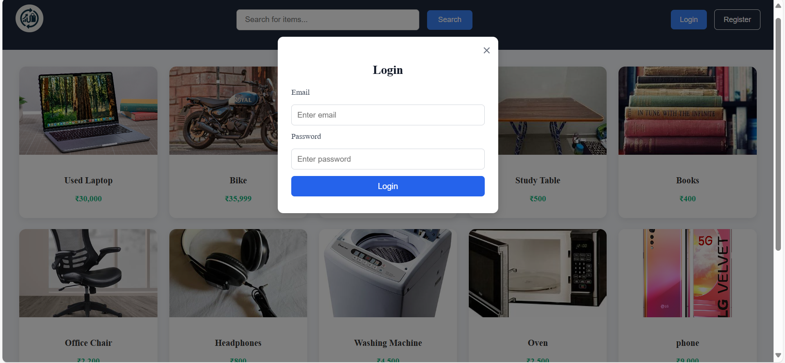

### **2. Register Page**  
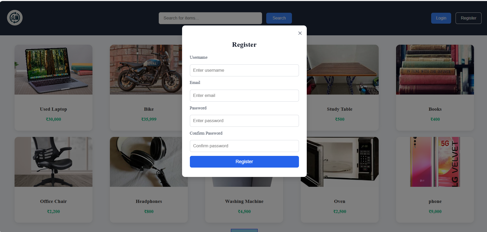

### **3. Home Page with Listings**  
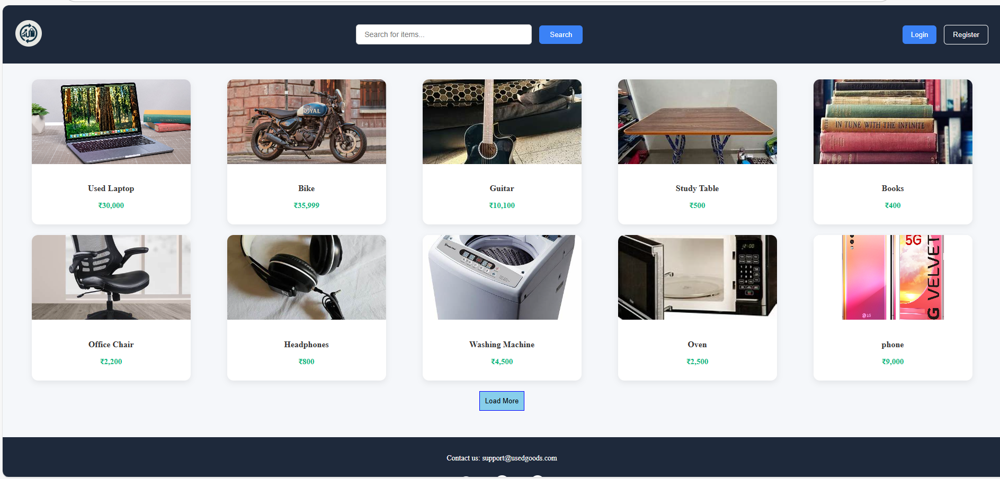

### **4. User Dashboard**  
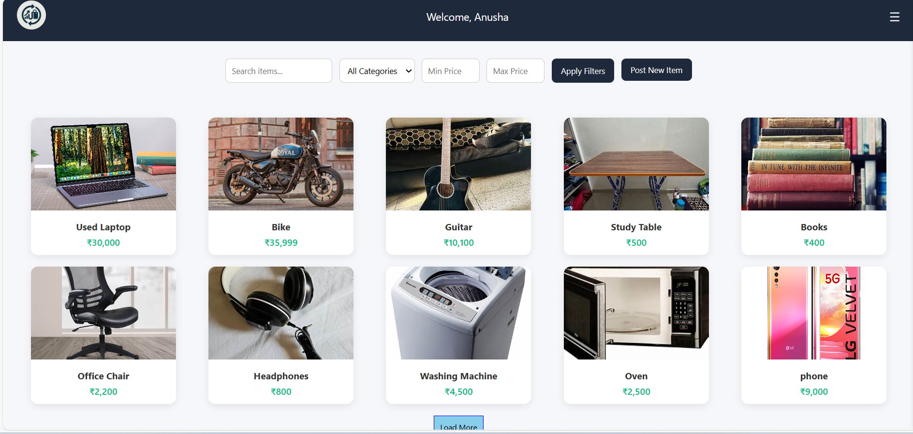

### **5. Post new item Page**  
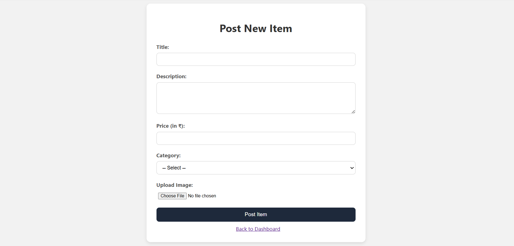

### **6. My Listings Page**  
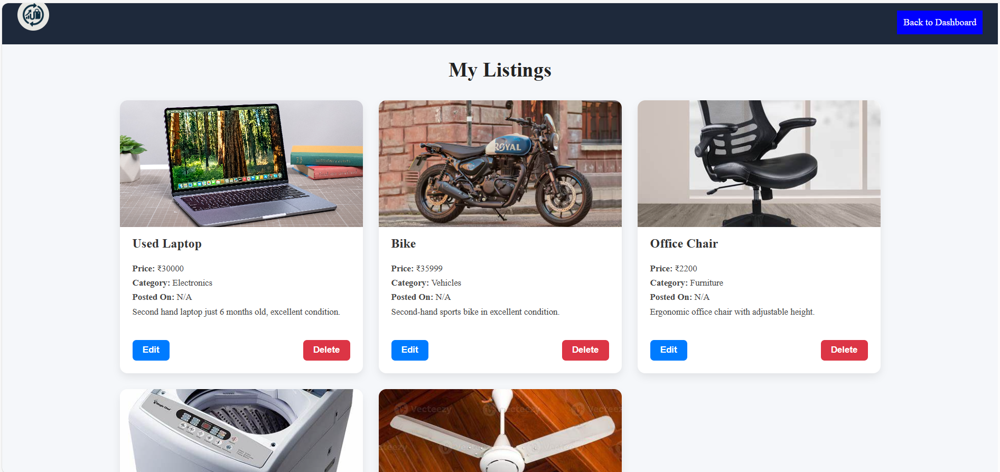

### **7. Edit Profile Page**  
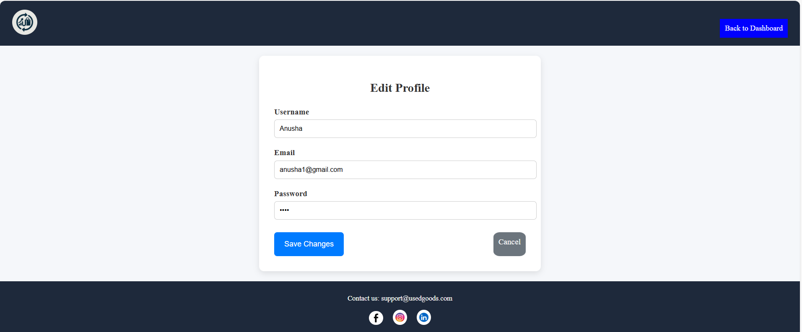

### **8. Product Details Page**  
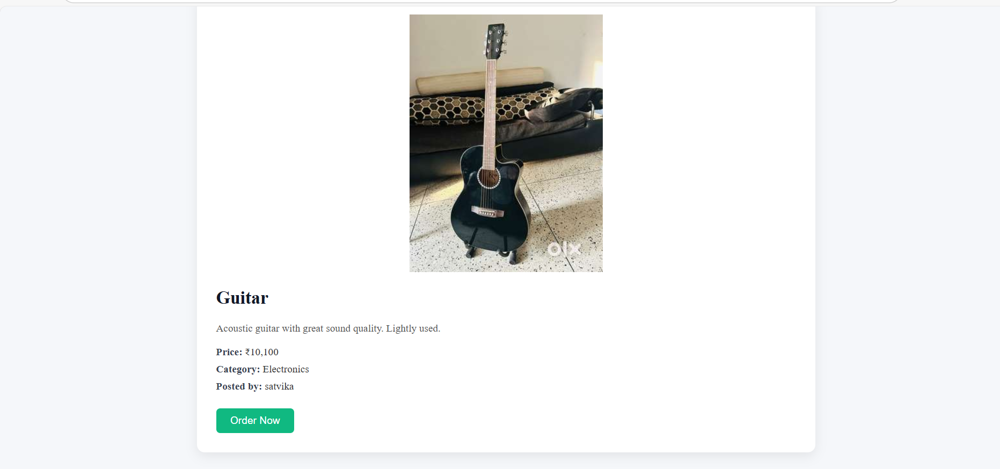

### **9. Place Order Page**  
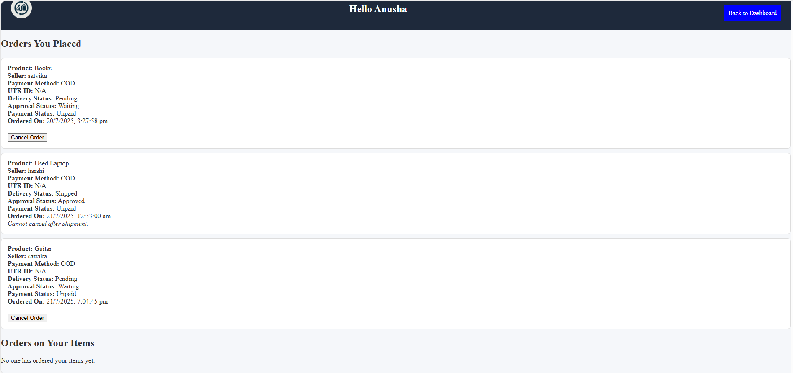

### **10. become Seller Page**  
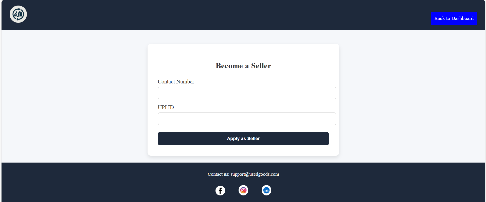

### **11. Admin Dashboard**  
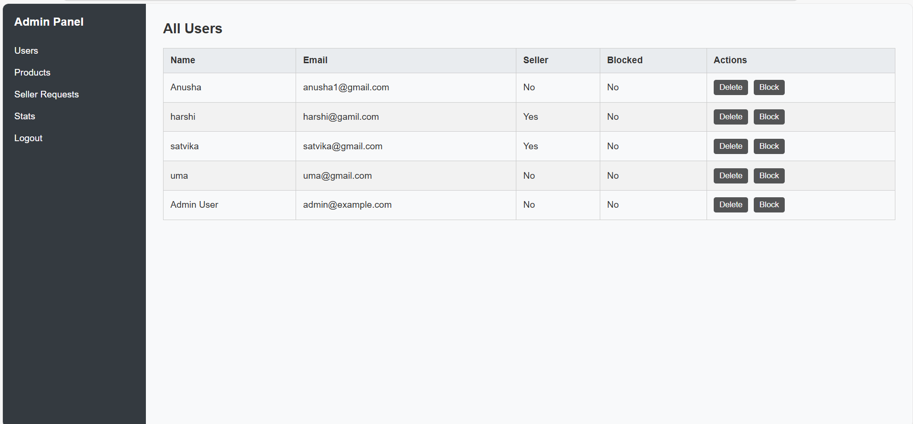

---

## 🛠️ Technologies Used

- **Frontend:** HTML, CSS, EJS
- **Backend:** Node.js, Express.js
- **Database:** MongoDB with Mongoose
- **Authentication:** express-session
- **File Uploads:** Multer
- **Flash Messages:** connect-flash
- **Password Security:** bcrypt
- **Templating Engine:** EJS

---

## 🧪 Future Enhancements

- Add product reviews and ratings
- Mobile responsive design
- Real-time chat using sockets (optional)
- Enhanced analytics in admin dashboard
- Email/OTP verification for users

---
